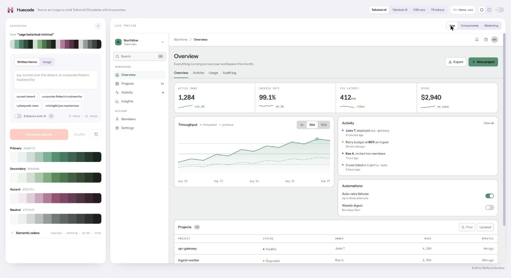
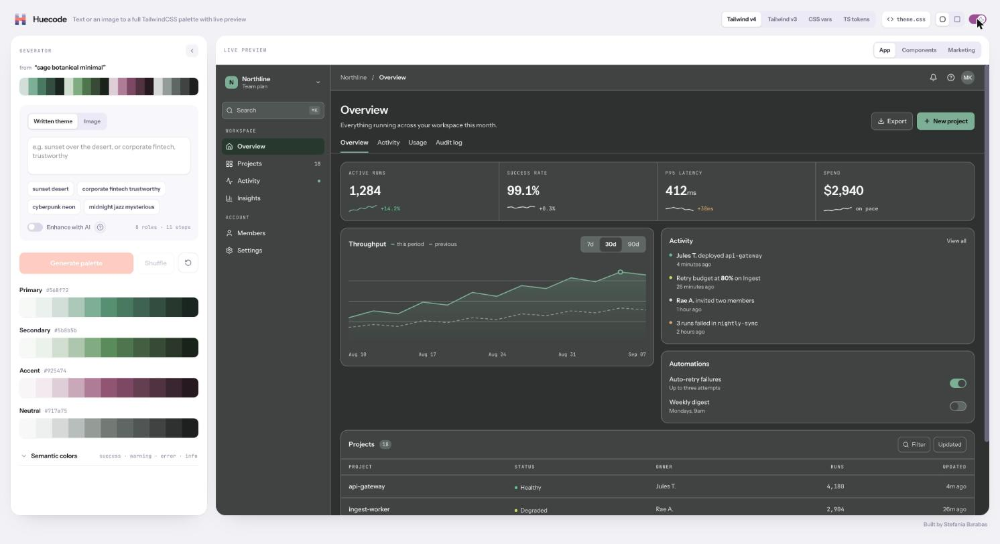
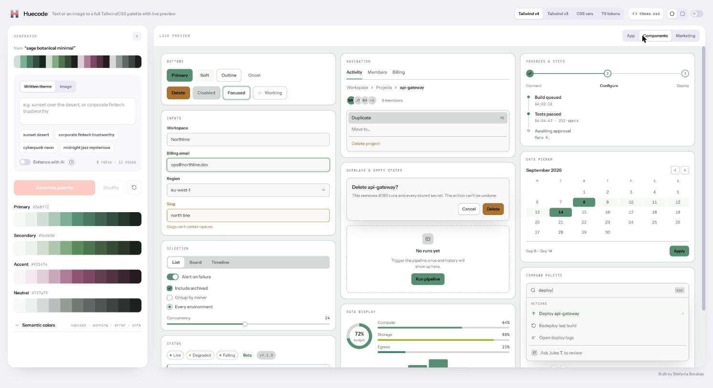
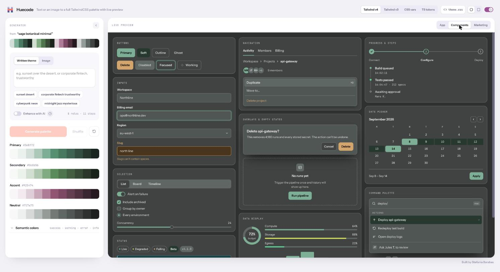
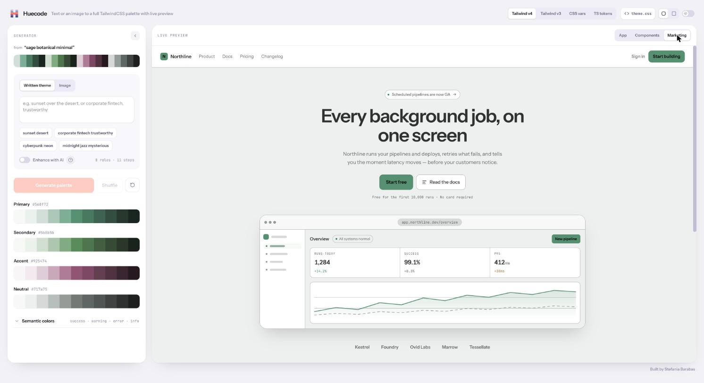
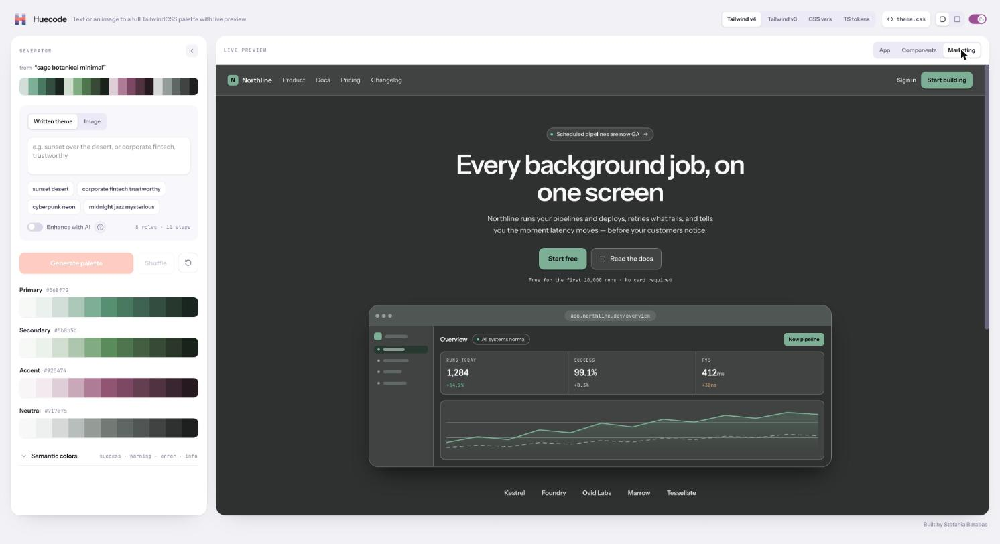

# Huecode

Turn a few words or an image into an accessible Tailwind color palette. See it on real interface mockups in light and dark, then copy the code.



<details>
<summary>More screenshots</summary>

| | Light | Dark |
| --- | --- | --- |
| App |  |  |
| Components |  |  |
| Marketing |  |  |

</details>

## What it does

- **Generate from text or an image.** Type a theme like "sunset over the sea" or start from an image. Plain text generation works offline and gives the same palette for the same words. Shuffle produces variations.
- **AI enhancement (optional).** With an Anthropic API key, the text path can ask Claude for a palette instead.
- **A full scale per role.** Each color role gets an 11-step shade scale, plus semantic tokens for light and dark themes.
- **Live preview.** The palette is applied to App, Components and Marketing mockups, in light and dark, with soft or sharp corners.
- **Export.** Copy or download the result as Tailwind v4, Tailwind v3, CSS variables or TypeScript tokens. Every format includes both the shade scale and the semantic light and dark tokens.

## Quick start

Requires Node 22.

```bash
git clone https://github.com/larisabarabas/huecode.git
cd huecode
npm ci
npm run dev
```

Then open `http://localhost:5173`. The API runs on port 8787.

### Scripts

| Command | What it does |
| --- | --- |
| `npm run dev` | Web app and API together, with reload |
| `npm run build` | Type-checks the app and the server, then builds |
| `npm test` | Runs the Vitest suite |
| `npm start` | Runs the API server |

## AI enhancement and your API key

Everything except AI enhancement works with no key at all.

To use the AI path, copy `.env.example` to `.env` and add your own `ANTHROPIC_API_KEY`. The key is read only on the server (`server/env.ts`) and is never sent to the browser. Without a key, the server reports AI as unavailable through `/api/config` and the app hides the AI option.

The server limits AI requests to 30 per hour per client. On serverless hosts this limit is best-effort. Requests to the AI path use your key and can cost money, so keep it out of version control. `.env` is already in `.gitignore`.

## Fonts

The interface loads Instrument Sans and JetBrains Mono, both open-licensed, from Google Fonts at runtime. That means Google receives a request when the page loads.

## Roadmap

A snapshot of what's planned. Priorities can change, and an issue is the place to discuss anything here.

- A loading state for AI generation, so the palette doesn't look frozen while waiting
- More accurate color extraction from images
- Support for AI providers besides Anthropic
- Showing the raw colors the AI proposed, before the shade scales are built

## Contributing

Contributions are welcome, and Huecode works issue-first: open an issue before you write code, for everything. See [CONTRIBUTING.md](CONTRIBUTING.md) for the scope, setup and PR checklist. To report a security problem privately, see [SECURITY.md](SECURITY.md).
## License

[MIT](LICENSE) © 2026 Stefania Barabas
